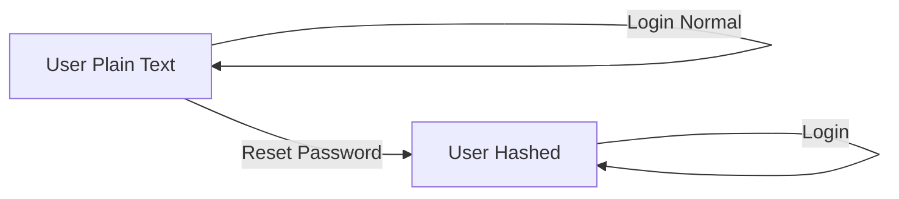

# 🔐 Password Authentication với Bcrypt

## ✅ Đã hoàn thành

Form login giờ đã hỗ trợ **cả hai loại password**:
- 🔓 **Plain text** (passwords cũ trong DB)
- 🔒 **Bcrypt hash** (passwords mới sau khi reset)

---

## 🔄 Cách hoạt động

### Login Flow

```typescript
// User login với password
login('AnhNT@email.com', '1234')
  ↓
// 1. Tìm user theo email/username
foundUser = { email: 'AnhNT@email.com', password: '...' }
  ↓
// 2. Check password type
if (password.startsWith('$2a$') || password.startsWith('$2b$')) {
  // Bcrypt hash detected
  passwordMatch = await bcrypt.compare('1234', hashed)
} else {
  // Plain text
  passwordMatch = ('1234' === '1234')
}
  ↓
// 3. Login if match
if (passwordMatch) ✓
```

---

## 📊 Password Types Support

| Password Type | Format | Example | Login Method |
|--------------|--------|---------|--------------|
| **Plain Text** | Raw string | `1234` | Direct compare |
| **Bcrypt Hash** | `$2a$11$...` | `$2a$11$XyZ...` | bcrypt.compare() |

---

## 🧪 Test Scenarios

### Scenario 1: Login với Plain Text Password (Legacy)
```typescript
// DB: { email: 'AnhNT@email.com', password: '1234' }
login('AnhNT@email.com', '1234')
→ ✅ Success (plain text compare)
```

### Scenario 2: Login với Hashed Password (New)
```typescript
// DB: { email: 'user@email.com', password: '$2a$11$abc...' }
login('user@email.com', 'newpass123')
→ await bcrypt.compare('newpass123', '$2a$11$abc...')
→ ✅ Success (bcrypt compare)
```

### Scenario 3: Wrong Password
```typescript
login('AnhNT@email.com', 'wrongpass')
→ ❌ Failed (không match)
```

---

## 🔍 Code Changes

### [AuthContext.tsx](file:///d:/project/G2_MoneyTracker_app/src/context/AuthContext.tsx)

**Before:**
```typescript
const foundUser = res.data.find(u =>
  (u.username === identifier || u.email === identifier) && 
  u.password === password  // ❌ Chỉ plain text
);
```

**After:**
```typescript
// 1. Tìm user
const foundUser = res.data.find(u =>
  u.username === identifier || u.email === identifier
);

// 2. Verify password type
if (foundUser.password.startsWith('$2a$') || foundUser.password.startsWith('$2b$')) {
  // ✅ Bcrypt hash
  passwordMatch = await bcrypt.compare(password, foundUser.password);
} else {
  // ✅ Plain text
  passwordMatch = foundUser.password === password;
}
```

---

## 📝 Database Examples

### User với Plain Text Password
```json
{
  "id": "1",
  "email": "AnhNT@email.com",
  "password": "1234"  // Plain text
}
```
**Login:** `login('AnhNT@email.com', '1234')` → ✅ Success

---

### User với Hashed Password (sau khi reset)
```json
{
  "id": "2",
  "email": "user@email.com",
  "password": "$2a$11$vK8X7Y..."  // Bcrypt hash
}
```
**Login:** `login('user@email.com', 'originalPassword')` → ✅ Success

---

## 🎯 Benefits

### ✅ Backward Compatibility
- Không cần migrate tất cả passwords cùng lúc
- Users cũ vẫn login bình thường
- Passwords được upgrade dần dần

### 🔒 Security
- Passwords mới được hash bằng bcrypt
- Salt rounds = 11 (2048 iterations)
- Resistant to brute force attacks

### 🚀 Smooth Migration
- Không downtime
- Không impact users hiện có
- Tự động upgrade khi reset password

---

## 🔄 Migration Path

### Cách passwords được upgrade:



1. **User cũ** (plain text):
   - Login bình thường → OK
   - Reset password → Password được hash
   - Login lần sau → Dùng bcrypt compare

2. **User mới** (hashed):
   - Login → Dùng bcrypt compare
   - Reset password → Password vẫn được hash

---

## 📊 Current Database State

Sau khi implement:

```json
{
  "users": [
    {
      "id": "1",
      "email": "AnhNT@email.com",
      "password": "1234"  // ⚠️ Plain text (chưa reset)
    },
    {
      "id": "2",
      "email": "AnhBN@email.com", 
      "password": "123"  // ⚠️ Plain text (chưa reset)
    },
    {
      "id": "7699",
      "email": "maphongba7791@gmail.com",
      "password": "123"  // ⚠️ Plain text (chưa reset)
    }
  ]
}
```

**Sau khi user reset password:**
```json
{
  "users": [
    {
      "id": "1",
      "email": "AnhNT@email.com",
      "password": "$2a$11$..."  // ✅ Hashed!
    }
  ]
}
```

---

## 🔧 Optional: Full Migration Script

Nếu muốn hash TẤT CẢ passwords ngay:

```typescript
// scripts/hashAllPasswords.ts
import bcrypt from 'bcryptjs';
import fs from 'fs';

async function hashAllPasswords() {
  const db = JSON.parse(fs.readFileSync('db.json', 'utf-8'));
  
  for (const user of db.users) {
    // Skip if already hashed
    if (user.password.startsWith('$2a$') || user.password.startsWith('$2b$')) {
      console.log(`✓ ${user.email} already hashed`);
      continue;
    }
    
    // Hash password
    const hashed = await bcrypt.hash(user.password, 11);
    user.password = hashed;
    console.log(`✓ Hashed password for ${user.email}`);
  }
  
  fs.writeFileSync('db.json', JSON.stringify(db, null, 2));
  console.log('✅ All passwords hashed!');
}

hashAllPasswords();
```

**Run:**
```bash
npx ts-node scripts/hashAllPasswords.ts
```

---

## ✅ Verification

### Test Login với các users:

1. **Plain Text User:**
```typescript
login('AnhNT@email.com', '1234')
→ Should work ✅
```

2. **After Reset:**
```typescript
// Reset password to 'newpass123'
login('AnhNT@email.com', 'newpass123')  
→ Should work ✅ (bcrypt compare)

login('AnhNT@email.com', '1234')
→ Should fail ❌ (old password)
```

---

## 🎉 Summary

- ✅ Login hỗ trợ cả plain text và bcrypt hash
- ✅ Backward compatible với users cũ
- ✅ Passwords mới tự động được hash
- ✅ Salt rounds = 11 để security
- ✅ Không cần migrate database ngay
- ✅ Users experience không bị ảnh hưởng

---

Made with 🔒 for Money Tracker App
